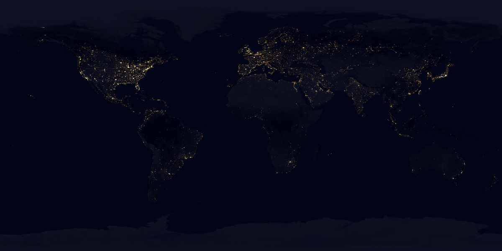

# Nocturne Earth — Android weather globe

A polished native Android 10+ weather app with a hardware-rendered 3D night Earth. It is built
without Unity, a WebView, or a third-party 3D engine: the planet, cloud veil, glow, stars,
markers, orbit inertia, and pinch zoom are batched OpenGL ES 2.0 draw calls.



> The preview image is illustrative. The app itself uses the bundled high-resolution night texture
> and live Open-Meteo conditions only after a city is selected.

## What is included

- **3D night planet:** high-resolution satellite-derived city lights, soft cloud veil, blue
  atmospheric rim, and a twinkling star field.
- **Fluid controls:** one-finger 360° orbit, momentum, pinch zoom, gentle auto-orbit, and
  double-tap reset. The globe remains native GLES 2.0 for broad Android 10+ support.
- **Global city signals:** a bundled catalog of capital cities and major metros; tap a visible cyan
  signal or search from the menu to focus it.
- **Live weather + local time:** key-free Open-Meteo current conditions, WMO-condition labels,
  temperature/feels-like/humidity/wind/precipitation, and a per-city live IANA time-zone clock.
- **Planet tools menu:** city search, optional approximate device location, city-marker toggle,
  night-light toggle, cloud toggle, auto-orbit, units, reset, privacy text, and source credits.
- **Publishing setup:** API 29 minimum / API 36 target, debug + release Gradle targets, optional
  environment-driven signing, and a ready-to-enable GitHub Actions artifact-workflow template.

## Run it

Open the repository root in Android Studio with JDK 17 and Android SDK Platform 36 installed, or:

```bash
./gradlew assembleDebug
```

Install `app/build/outputs/apk/debug/app-debug.apk` on an Android 10+ device. Internet access is
needed only when you select or refresh weather. City positions and local clocks continue to work
without a connection.

See [RELEASE.md](RELEASE.md) for APK/AAB locations, signing, Play Store checklist, and the optional CI template.
See [ASSET_ATTRIBUTION.md](ASSET_ATTRIBUTION.md) for required image credits.

## Architecture

```
app/src/main/java/com/nocturne/earthweather/
├── MainActivity.java        HUD, weather card, city finder, tools drawer, time ticker
├── GlobeSurfaceView.java    touch/gesture bridge
├── GlobeRenderer.java       GLES sphere, shaders, stars, atmosphere, city markers and picking
├── CityCatalog.java         offline global city/capital catalogue
├── City.java                immutable city model
├── WeatherRepository.java   small Open-Meteo HTTPS client + eight-minute memory cache
└── WeatherSnapshot.java     normalized weather model + WMO condition names
```

## Data and privacy

The app has no analytics SDK, advertising SDK, account, or server. `INTERNET` is used for the
explicitly selected location's current Open-Meteo request. `ACCESS_COARSE_LOCATION` is only
requested after the user taps **My location**; the coordinate is used to center the globe and make
that single weather request and is not stored. Read the full asset/provider credit notes before
publishing.
